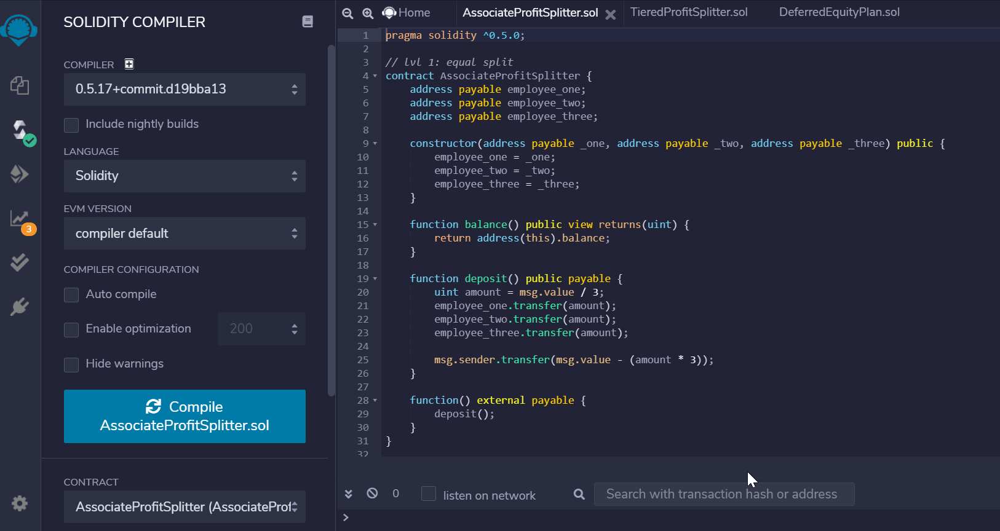
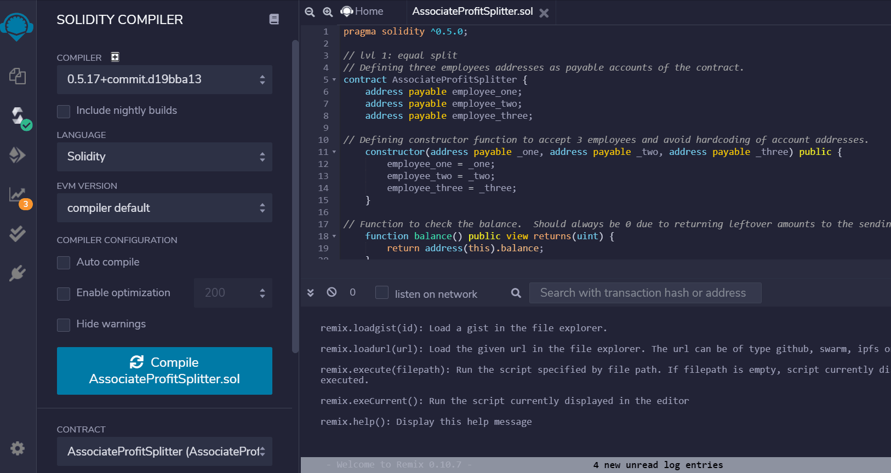
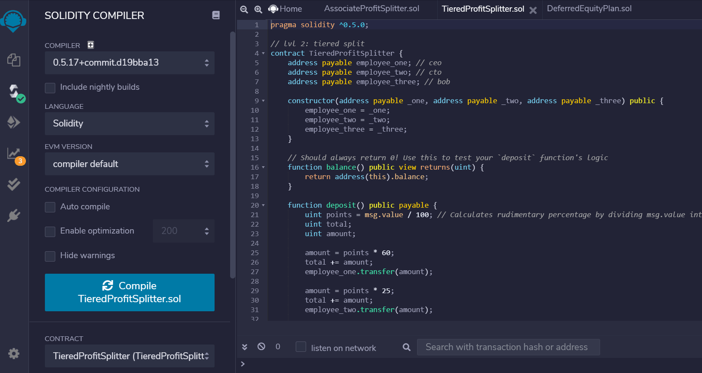
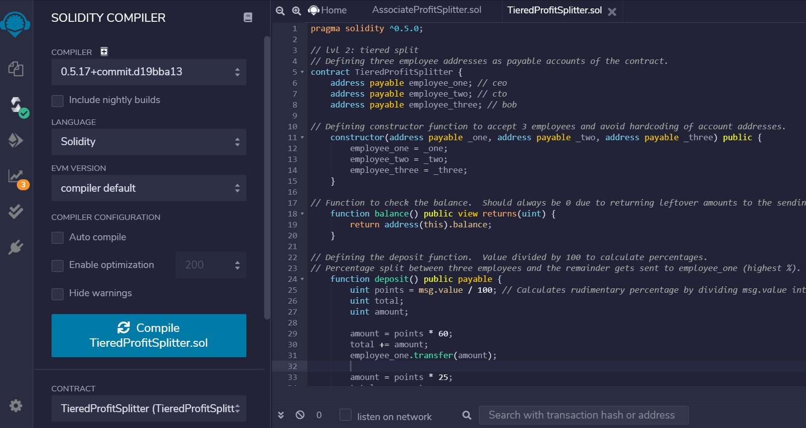
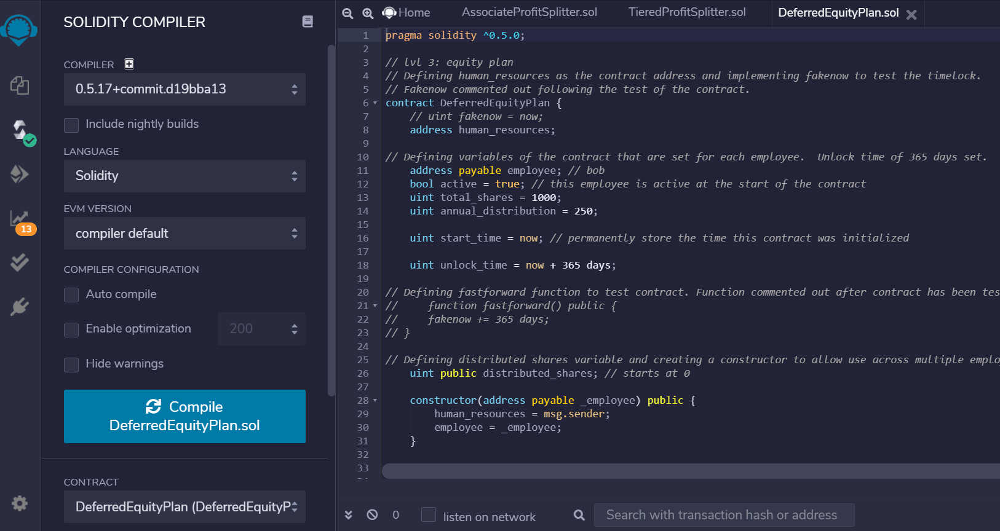
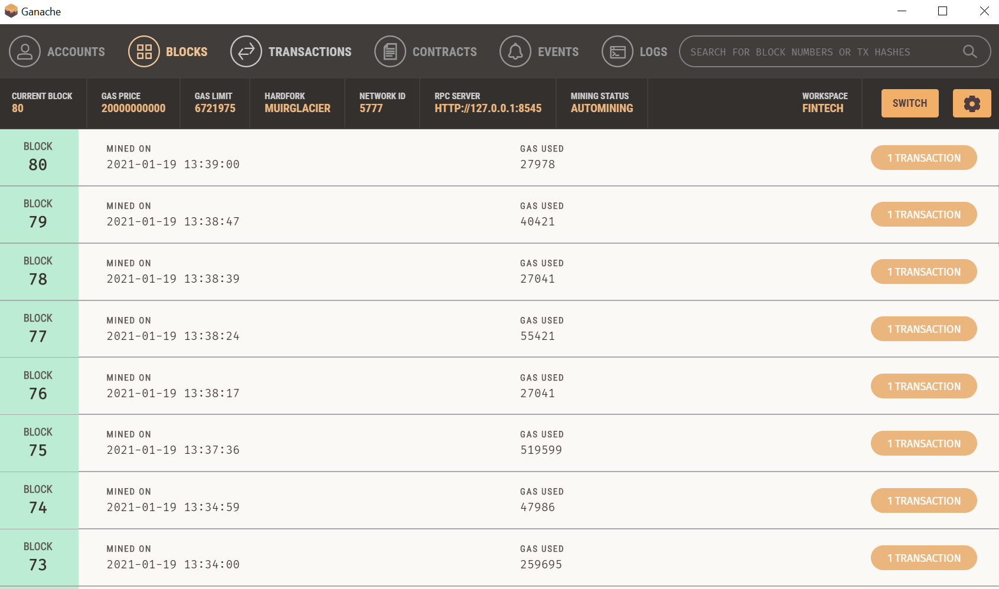

## Project Objective

The objective of this project was to create three separate smart contracts to handle varying equity distributions.  The Associate Profit Splitter contract has been designed to split profits evenly between three employees.  The Tiered Profit Splitter contract splits profits by employee based on a designated percentage.  Finally, the Deferred Equity Plan contract was designed to distribute equity shares equally over a four-year vesting period to each employee.  

### Associate Profit Splitter Contract

As mentioned above, this contract distributes profits equally between three defined employees.  Employees may vary, as a constructor function was leveraged in this contract to allow for flexibility and multiple contract use.  This contract is designed to assume that all employees will always be provided an equal share.  To ensure no remainder profits are lost, any remaining ETH (wei) sent will be transferred back to the sender.  Finally, a fallback function was included to allow for acceptance of any external deposits of ETH.  

The gif below provides an example of how the contract can be interacted with.  It was deployed here to my LocalHost 8545 and tested by sending wei and ETH to each employee.  ETH was used to allow for a better visual of transactions occurring on all accounts.  To ensure the "balance" function worked correctly by always displaying a value of 0, wei had to be used.  This is due to uint limitations being exceeded (maximum integer values) when transacting with ETH.    

This contract was also deployed on Ropsten.  The contract address can be found below, along with a link directly to the contract address on Etherscan. 
  - Contract Address: 0xe64cef5B13A52e21ae4648AF495e06Af2593EFE1
  - Etherscan Link: https://ropsten.etherscan.io/address/0xe64cef5b13a52e21ae4648af495e06af2593efe1

The below gif outlines the deployment of the contract to Ropsten.  

### Tiered Profit Splitter Contract

This contract was created to distribute profits on a tiered basis to three employees.  Similar to the first contract, a constructor function was utilized to allow for multiple contract uses.  Within the deposit function of this contract a points variable was defined to equal msg.value / 100.  This calculates rudimentary percentages for ease of use within the contract.  The three employees are assigned various percentages of profit they will receive (60% / 25% / 15%).  A total running amount of profits distributed was calculated via the "total" variable.  This was then subtracted from the original value and any reamaining profits are distributed to the highest profit employee, being employee one in this contract.  This ensures no balance of wei is leftover.  Finally, a fallback function is included in this contract as well to accept any deposits from external accounts. 

The gif below provides an example of how the contract can be interacted with.  It was deployed here to my LocalHost 8545 and tested by sending wei and ETH to each employee.  ETH was used to allow for a better visual of transactions occurring on all accounts.  To ensure the "balance" function worked correctly by always displaying a value of 0, wei had to be used.  This is due to uint limitations being exceeded (maximum integer values) when transacting with ETH.    

This contract was also deployed on Ropsten.  The contract address can be found below, along with a link directly to the contract address on Etherscan. 
  - Contract Address: 0xD4f3c127B83bc0c9481e569508f8313a9fE24F6C
  - Etherscan Link: https://ropsten.etherscan.io/address/0xd4f3c127b83bc0c9481e569508f8313a9fe24f6c

The below gif outlines the deployment of the contract to Ropsten.  

### Deferred Equity Plan Contract

This contract was created to distribute equity shares annually to employees.  The contract address is defined as human resources, as they would be the ones utilizing this contract to ensure proper equity distributions or contract terminations for each employee.  Initial variables defined in the contract are "employee", "active", "total_shares", "annual_distribution", "start_time", and "unlock_time".  The "active" variable determines if the employee is still an active employee and eligible to receive shares.  The variables of "total_shares" and "annual_distribution" are used to determine how many shares need to be distributed each year, based on a four-year vesting period.  To ensure shares are only distributed annually, the "start_time" variable is set to now and the "unlock_time" variable is 365 days from now.  This means shares will be distributed once every 365 days, until all shares have been distributed.  

To actually distribute shares, a "distribute" function was created.  Within this function there are four require statements.  These ensure that the msg.sender is either human resources or the employee, the employee is still active, the required unlock time has been satisfied, and the total amount of shares distributed does not exceed the total shares each employee is eligible to receive.  The "unlock_time" variable is then increased by 365 days to restart the clock before more shares are distributed.  A "distributed_shares" variable is defined, which calculates total share distribution for each employee.  Finally, an if statement is incorporated to double check share distributions just in case the employee cashes out after 5+ years.  The deactivate function allows human resources or the employee to deactivate the contract at any time.  Like the two prior contracts, a fallback function closes out this contract.  

This contract was tested using "fakenow" and the "fast_forward" function.  This allowed the unlock time requirement to be met and distributions be simulated.  After ensuring the contract worked, all "fakenow" syntax was reverted back to "now" syntax.  Additionally, the "fast_forward" function was commented out.  The gif below provides an example of how the contract can be interacted with.  It was deployed here to my LocalHost 8545 and the "fast_forward" function was initiated.  Once that was done shares were able to be distributed and the distributed shares amount was able to be checked.  

This contract was also deployed on Ropsten.  The contract address can be found below, along with a link directly to the contract address on Etherscan. 
  - Contract Address: 0xc9f60D5F3bd46639F18F97937e3dc07B10a68def
  - Etherscan Link: https://ropsten.etherscan.io/address/0xc9f60d5f3bd46639f18f97937e3dc07b10a68def

The below gif outlines the deployment of the contract to Ropsten.  

Finally, the screenshot below provides an example of transaction / block history from deploying and testing all three contracts.  

